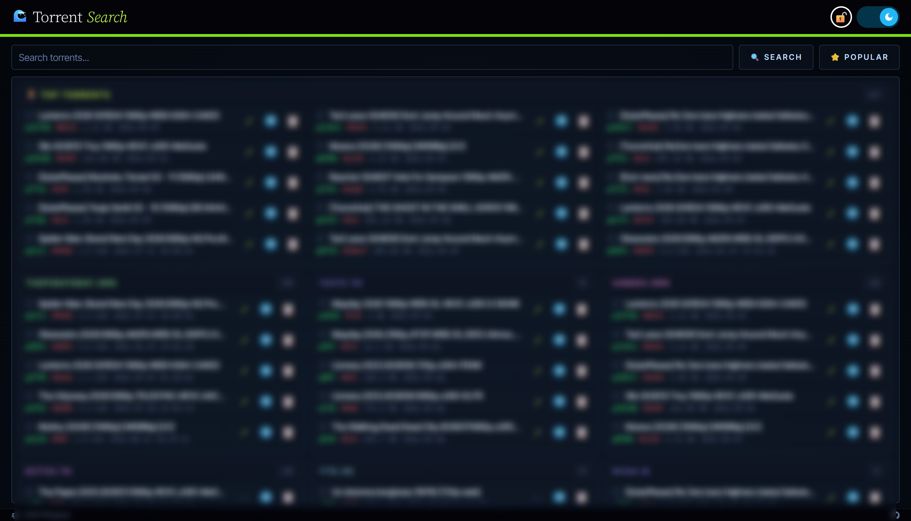

# Torrent Search MCP/API/WebUI

[](https://docs.astral.sh/uv/getting-started/installation/)
[](https://www.python.org/downloads/)
[](https://badge.fury.io/py/torrent-search-mcp)
[](https://github.com/philogicae/torrent-search-mcp/actions)
[](https://opensource.org/licenses/MIT)
[](https://deepwiki.com/philogicae/torrent-search-mcp)

This repository provides a Python API/WebUI and an MCP (Model Context Protocol) server to find torrents programmatically on **ThePirateBay**, **1337x**, **Nyaa**, **YTS**, **EZTV**, **FitGirl**, **SubsPlease**, **BitTorrented** and **UIndex**. It allows for easy integration into other applications or services.

<div align="center" style="margin: 20px 0;">
  
</div>

## Quickstart

> [How to use it with MCP Clients](#via-mcp-clients)

> [Run it with Docker to bypass common DNS issues](#for-docker)

> [Search directly from the command line](#as-cli)

```bash
uvx torrent-search-mcp --mode cli "breaking bad"

# MCP server over stdio (default)
uvx torrent-search-mcp --mode stdio

# MCP server over streamable HTTP (port 8000, endpoint /mcp)
uvx torrent-search-mcp --mode http

# MCP server over SSE (port 8000, endpoint /sse, legacy)
uvx torrent-search-mcp --mode sse

# Standalone API server (port 8000)
uvx torrent-search-mcp --mode api
```

## Table of Contents

- [Features](#features)
- [Supported Sources](#supported-sources)
- [Setup](#setup)
  - [Prerequisites](#prerequisites)
  - [Configuration](#configuration-optional)
  - [Installation](#installation)
    - [Install from PyPI (Recommended)](#install-from-pypi-recommended)
    - [For Local Development](#for-local-development)
    - [For Docker](#for-docker)
- [Usage](#usage)
  - [As CLI](#as-cli)
  - [As Python Wrapper](#as-python-wrapper)
  - [As MCP Server](#as-mcp-server)
  - [As API Server](#as-api-server)
  - [Via MCP Clients](#via-mcp-clients)
    - [Example with Devin](#example-with-devin)
- [Changelog](#changelog)
- [Contributing](#contributing)
- [License](#license)

## Features

- API wrapper for **ThePirateBay**, **1337x**, **Nyaa**, **YTS**, **EZTV**, **FitGirl**, **SubsPlease**, **BitTorrented** and **UIndex**.
- MCP server interface for standardized communication (`stdio`, `sse`, `streamable-http`).
- API server interface for alternative HTTP access (e.g., for direct API calls or testing).
- CLI mode for quick one-off searches directly from the terminal.
- In-memory + `aiocache` result caching to reduce redundant scraping.
- Configurable source filtering via environment variables.
- Tools:
  - Search for torrents across all available sources.
  - Get the most popular torrents per source (apibay, uindex, 1337x, YTS, nyaa, EZTV).
  - Get the magnet link for a specific torrent by id.
  - List available sources.

## Supported Sources

| Source       | Domain                 | Fetch method  |
| ------------ | ---------------------- | ------------- |
| ThePirateBay | `apibay.org`           | HTTP API      |
| 1337x        | `1337x.to`             | HTTP API      |
| Nyaa         | `nyaa.si`              | HTTP API      |
| YTS          | `yts.mx`               | HTTP API      |
| EZTV         | `eztvx.to`             | HTTP API      |
| FitGirl      | `fitgirl-repacks.site` | HTTP API      |
| SubsPlease   | `subsplease.org`       | HTTP API      |
| BitTorrented | `bittorrented.com`     | HTTP API      |
| UIndex       | `uindex.org`           | HTTP top list |

> **Note on UIndex:** the site exposes no programmatic search endpoint (its search path is protected by a browser challenge), so queries are matched client-side against its live top list - which conveniently carries magnet links inline.

Sources can be excluded individually via the [`EXCLUDE_SOURCES`](#configuration-optional) env var.

## Setup

### Prerequisites

- Python 3.10+ (required for PyPI install). CI and Docker images use Python 3.14.
- [`uv`](https://github.com/astral-sh/uv) (for local development).
- Docker and Docker Compose (for Docker setup).

### Configuration (Optional)

The application reads configuration from environment variables. The recommended way to set them is by creating a `.env` file in your project's root directory. The application will load it automatically. See `.env.example` for all available options.

| Variable                 | Default  | Description                                                                                                                                                                    |
| ------------------------ | -------- | ------------------------------------------------------------------------------------------------------------------------------------------------------------------------------ |
| `INCLUDE_LINKS`          | `false`  | When `true`, include magnet links in the MCP `search_torrents` / `popular_torrents` results. Left off by default to greatly reduce token usage.                                |
| `EXCLUDE_SOURCES`        | _(none)_ | Comma-separated list of sources to exclude from results (e.g. `nyaa.si,1337x.to`).                                                                                             |
| `TORRENT_SEARCH_API_URL` | _(none)_ | MCP only: base URL of a running Torrent Search REST API - tools proxy it instead of scraping locally. Unset = standalone.                                                      |
| `TELEGRAM_BOT_HANDLE`    | _(none)_ | Telegram bot handle used by the Web UI torrent action. Unset = the web UI runs without the pairing gate and Telegram features stay hidden.                                     |
| `TORRENT_SEARCH_API_KEY` | _(none)_ | Secret required to approve Web UI pairing codes (register endpoint + `authorize_webapp` MCP tool). Must match between API and MCP servers. Unset = pairing disabled (no gate). |
| `WEBUI_URL`              | _(none)_ | MCP only: public URL of the web UI; enables the `torrent_webapp` tool that presents the app and its pairing flow.                                                              |

### Installation

Choose one of the following installation methods.

#### Install from PyPI (Recommended)

This method is best for using the package as a library or running the server without modifying the code.

1.  Install the package from PyPI:

```bash
pip install torrent-search-mcp
```

2.  Create a `.env` file in the directory where you'll run the application (optional).

3.  Run the MCP server (default: stdio):

```bash
python -m torrent_search
```

#### For Local Development

This method is for contributors who want to modify the source code.
Using [`uv`](https://github.com/astral-sh/uv):

1.  Clone the repository:

```bash
git clone https://github.com/philogicae/torrent-search-mcp.git
cd torrent-search-mcp
```

2.  Install dependencies using `uv`:

```bash
uv sync --frozen
```

3.  Create your configuration file by copying the example:

```bash
cp .env.example .env
```

4.  Run the MCP server (default: stdio):

```bash
uv run -m torrent_search
```

The repo also ships a `dev.sh` helper that locks/syncs deps, formats, lints, type-checks (`ty`) and runs the test suite with coverage:

```bash
./dev.sh
```

#### For Docker

This method uses Docker Compose to run **two containers**: the REST API + web UI, and an MCP server that proxies the API (no local scraping).

`compose.yaml` is configured to bypass DNS issues (using [quad9](https://quad9.net/) DNS).

| Container            | Mode   | Host port | Endpoints                                                                                  |
| -------------------- | ------ | --------- | ------------------------------------------------------------------------------------------ |
| `torrent-search-api` | `api`  | `8000`    | `/` (web UI), `/torrent/*`, `/sources`, `/docs`                                            |
| `torrent-search-mcp` | `http` | `8001`    | `/mcp` (MCP over streamable HTTP, `TORRENT_SEARCH_API_URL=http://torrent-search-api:8000`) |

1.  Clone the repository (if you haven't already):

```bash
git clone https://github.com/philogicae/torrent-search-mcp.git
cd torrent-search-mcp
```

2.  Create your configuration file by copying the example:

```bash
cp .env.example .env
```

3.  Build and run the containers using Docker Compose:

```bash
docker compose up --build -d
```

4.  Access container logs:

```bash
docker logs torrent-search-api -f
docker logs torrent-search-mcp -f
```

## Usage

The package exposes a single entry point, `torrent-search-mcp` (installed by `pip`/`uvx`), equivalent to `python -m torrent_search`. It supports the following `--mode` values:

| Mode              | Endpoint | Description                                                                                                            |
| ----------------- | -------- | ---------------------------------------------------------------------------------------------------------------------- |
| `cli`             | -        | Run a single search query and print results to stdout.                                                                 |
| `stdio`           | -        | MCP server over stdio (default).                                                                                       |
| `http`            | `/mcp`   | MCP server using streamable HTTP (fastmcp's canonical HTTP alias).                                                     |
| `streamable-http` | `/mcp`   | Same as `http`; the modern, MCP-spec-recommended HTTP transport.                                                       |
| `sse`             | `/sse`   | MCP server using Server-Sent Events. Legacy HTTP transport (deprecated by the MCP spec in favor of `streamable-http`). |
| `api`             | `/`      | Standalone API HTTP server (see [As API Server](#as-api-server)).                                                      |

MCP modes (`stdio`, `http`, `streamable-http`, `sse`) run **standalone** by default (tools scrape locally). Set [`TORRENT_SEARCH_API_URL`](#configuration-optional) to switch to **API mode**: the tools proxy a running Torrent Search REST API instead.

Common flags (for `http`, `streamable-http`, `sse` and `api` modes): `--host` (default `0.0.0.0`), `--port` (default `8000`), `--reload`, `--workers` (API only).

### As CLI

Run a one-off search directly from the terminal. Prints each result as `id (seeders|leechers|downloads) - filename`, then fetches the magnet/torrent for the top hit.

```bash
# Using the installed entry point
torrent-search-mcp --mode cli "breaking bad"

# Or via uvx without installing
uvx torrent-search-mcp --mode cli "breaking bad"

# Or from source
uv run -m torrent_search --mode cli "breaking bad"
```

### As Python Wrapper

```python
from torrent_search import torrent_search_api

results = await torrent_search_api.search_torrents("breaking bad")
for torrent in results:
    print(
        f"{torrent.filename} | {torrent.size} | {torrent.seeders} SE | {torrent.leechers} LE | {torrent.date} | {torrent.source}"
    )
```

`search_torrents` is async and accepts an optional `max_items` (default `10`). `popular_torrents(per_source=20)` returns the current most popular torrents from sources with a top listing - up to `per_source` results per source (pass `per_source=None` for everything), merged and ranked by seeders + leechers. Each `Torrent` exposes `id`, `filename`, `size`, `seeders`, `leechers`, `date`, `source`, and (when available) `magnet_link`. Pass a torrent's `id` to `get_torrent()` to retrieve its magnet link.

### As MCP Server

```python
from torrent_search import torrent_search_mcp

torrent_search_mcp.run(transport="sse")
```

### As API Server

This project also includes a API server as an alternative way to interact with the library via a standard HTTP API. This can be useful for direct API calls, integration with other web services, or for testing purposes.

**Running the API Server:**

```bash
# With Python
python -m torrent_search --mode api
# With uv
uv run -m torrent_search --mode api
```

- `--host <host>`: Default: `0.0.0.0`.
- `--port <port>`: Default: `8000`.
- `--reload`: Enables auto-reloading when code changes (useful for development).
- `--workers <workers>`: Default: `1`.

The API server will then be accessible at `http://<host>:<port>`.

**Available Endpoints:**
The API server exposes similar functionalities to the MCP server. Key endpoints include:

- `GET /`: Built-in web UI (dark/light) - search, per-site popular tiles, sortable results with magnet links. Telegram sending requires one-time pairing.
- `POST /torrent/search`: Search for torrents. Query params: `query` (required) and `max_items` (optional, default `20`).
- `GET /sources`: List the available torrent source domains.
- `GET /torrent/popular`: Get the most popular torrents. Query param: `per_source` (optional, default `20`).
- `GET /torrent/{torrent_id}`: Get the magnet link for a specific torrent by id. Returns the magnet URI as text.
- `GET /telegram/session`: Web UI auth state (send the session token as `Authorization: Bearer`); reveals the bot handle only to authenticated sessions.
- `POST /telegram/auth/challenge`: Create a one-time pairing code (rate-limited).
- `GET /telegram/auth/poll?code=`: Poll a pairing code; on approval returns the one-time session token for the browser to store.
- `DELETE /telegram/auth/challenge/{code}`: Cancel a pending pairing code.
- `POST /telegram/auth/register`: Approve a pairing code bound to a Telegram `chat_id`. Requires `Authorization: Bearer $TORRENT_SEARCH_API_KEY`.
- `POST /telegram/auth/logout`: Revoke the presented session token.
- `/docs`: Interactive API documentation (Swagger UI).
- `/redoc`: Alternative API documentation (ReDoc).

Environment variables are configured the same way as for the MCP server (via an `.env` file in the project root).

### Via MCP Clients

Usable with any MCP-compatible client. Available tools:

- `search_torrents(user_intent, query)`: Search for torrents across all available sources.
  - `user_intent`: A short description reflecting the user's overall intention (e.g. `"latest episode of Breaking Bad"`).
  - `query`: Optimized, lowercase, space-separated keywords (e.g. `"breaking bad s01e05"`). Generic/filler/technical terms should be stripped per the tool's docstring.
  - By default magnet links are stripped from the response to save tokens; set `INCLUDE_LINKS=true` to include them.
- `popular_torrents(per_source=20)`: Get the most popular torrents right now from sources with an official top listing (apibay, uindex, 1337x, YTS, nyaa, EZTV) - up to `per_source` results each, grouped per source and pre-ranked by seeders + leechers.
  - By default magnet links are stripped from the response to save tokens; set `INCLUDE_LINKS=true` to include them.
- `available_sources()`: Get the list of available torrent sources.
- `get_torrent(torrent_id)`: Get the magnet link for a specific torrent by id (the `id` returned by `search_torrents` or `popular_torrents`).
- `authorize_webapp(code, chat_id)`: Approve a Web UI pairing code bound to your Telegram chat id (the code shown in the browser pairing gate). Requires `TORRENT_SEARCH_API_KEY` and `TORRENT_SEARCH_API_URL`.
- `torrent_webapp()`: Present the web UI URL (`WEBUI_URL`) and its pairing-based access system.

#### Example with Devin

Configuration:

```json
{
  "mcpServers": {
    ...
    # with stdio (only requires uv)
    "torrent-search-mcp": {
      "command": "uvx",
      "args": [ "torrent-search-mcp" ]
    },
    # with streamable-http transport (Docker compose: MCP on port 8001; standalone server: 8000)
    "torrent-search-mcp": {
      "serverUrl": "http://127.0.0.1:8001/mcp"
    },
    # with sse transport (legacy; requires running server)
    "torrent-search-mcp": {
      "serverUrl": "http://127.0.0.1:8001/sse"
    },
    ...
  }
}
```

## Changelog

See [CHANGELOG.md](CHANGELOG.md) for a history of changes to this project.

## Contributing

Contributions are welcome! Please open an issue or submit a pull request.

## License

This project is licensed under the MIT License - see the [LICENSE](LICENSE) file for details.
